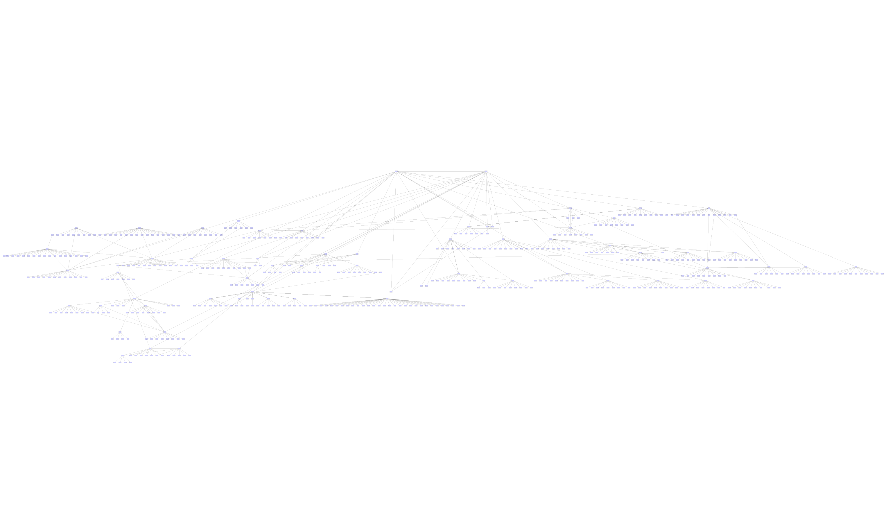

# Secure Cartography - Network Discovery and Mapping

## Overview
Secure Cartography is a comprehensive network discovery and mapping tool that automates the process of documenting network topologies through SSH-based device interrogation. The system leverages CDP/LLDP protocols to discover device relationships and generates professional-grade network diagrams with customizable device icons and multiple export formats.

### Key Features
- **Automated Network Discovery**: SSH-based multi-vendor device discovery
- **Enhanced Visualization**: Customizable device icons for professional diagrams
- **Multiple Output Formats**: JSON, GraphML (yEd), Draw.io, and SVG
- **Security-First Design**: Encrypted credential storage with master password protection
- **TextFSM Integration**: Advanced parsing engine for accurate device data extraction
- **Map Enhancement Tools**: Interactive icon mapping and diagram customization



## GUI Application Entry Point (`scart.py`)


### Credential Management System
- **Master Password Protection**: All credentials encrypted with user-defined master password
- **System Keyring Integration**: Leverages OS-native secure storage (Windows Credential Manager, macOS Keychain, Linux Secret Service)
- **PBKDF2 Key Derivation**: Strong cryptographic key generation from master password
- **Fernet Encryption**: Industry-standard symmetric encryption for credential storage

### Main Application Architecture
```python
class NetworkMapperWidget(QWidget):
    """Primary GUI widget handling discovery and visualization"""
    
    def __init__(self, creds_manager: SecureCredentials, parent=None):
        self.setup_ui()          # Initialize interface components
        self.load_settings()     # Load encrypted credentials and preferences
        self.set_dark_mode()     # Apply theme preferences
```

### GUI Configuration Management
The interface provides comprehensive configuration through organized sections:
- **Discovery Parameters**: Seed IP, credentials, timeout settings
- **Scope Control**: Maximum devices, exclusion patterns, domain filtering
- **Output Options**: Directory selection, map naming, layout algorithms
- **Real-time Monitoring**: Progress tracking, device status, queue management

### GUI-Based Discovery Workflow

#### User Interface Flow
1. **Credential Authentication**: Master password entry with secure credential loading
2. **Configuration Setup**: Network parameters and discovery options via organized forms
3. **Discovery Execution**: Multi-threaded processing with real-time progress monitoring
4. **Result Visualization**: Interactive preview with multiple export options

#### Discovery Worker Thread
```python
class NetworkDiscoveryWorker(QThread):
    """Non-blocking discovery execution"""
    device_discovered = pyqtSignal(str, str)  # Real-time device status
    discovery_complete = pyqtSignal(dict)     # Final statistics
    progress_update = pyqtSignal(dict)        # Queue and progress stats
    log_message = pyqtSignal(str)             # Detailed logging
```

The GUI maintains responsive interaction during discovery through:
- **Separate Worker Thread**: Discovery runs independently of UI thread
- **Real-time Updates**: Progress signals update interface components
- **Cancellation Support**: User can abort long-running discovery operations
- **Status Monitoring**: Device-by-device progress with color-coded results

#### Interactive Progress Monitoring
The interface provides comprehensive discovery feedback:
- **Progress Bar**: Overall completion percentage
- **Device List**: Real-time device status (processing, success, failed)
- **Statistics Panel**: Discovered, failed, queued, and total device counts
- **Log Output**: Detailed discovery events with configurable verbosity levels

#### Settings Persistence
```python
def save_settings(self):
    """Secure settings storage with credential encryption"""
    # Non-sensitive settings to QSettings
    self.settings.setValue('seed_ip', self.seed_ip.text())
    
    # Encrypted credential storage
    if self.creds_manager.is_unlocked():
        cred = {
            'primary_password': self.creds_manager.encrypt_value(self.password.text()),
            'alternate_password': self.creds_manager.encrypt_value(self.alt_password.text())
        }
        self.creds_manager.save_credentials([cred], credentials_path)
```

## Discovery Engine Integration

### NetworkDiscovery Backend Process
The GUI initiates discovery through a worker thread that manages the core `NetworkDiscovery` class:

#### Phase 1: Configuration and Initialization
```python
# GUI creates discovery configuration from form inputs
discovery_config = {
    'seed_ip': self.seed_ip.text(),
    'username': self.username.text(),
    'password': self.password.text(),
    'max_devices': self.max_devices.value(),
    'output_dir': Path(self.output_dir.text()),
    'layout_algo': self.layout_algo.currentText()
}

# Initialize discovery engine with GUI-provided configuration
discovery = NetworkDiscovery(DiscoveryConfig(**discovery_config))
```

Key components initialized:
- **Queue System** - Device processing queue
- **Tracking Sets** - Visited IPs, failed devices, unreachable hosts
- **Logger** - Progress and debug logging with GUI callback
- **Driver Discovery** - Multi-vendor device support

#### Phase 2: Seed Device Processing
```python
# Initialize with seed device from GUI configuration
seed_device = DeviceInfo(
    hostname=config.seed_ip,
    ip=config.seed_ip,
    username=config.username,
    password=config.password,
    timeout=config.timeout
)
queue.put(seed_device)
```

#### Phase 3: GUI-Integrated Discovery Loop
The main discovery loop operates with real-time GUI feedback:

```python
# GUI receives progress updates through Qt signals
def _handle_progress(self, progress_data):
    """Handle progress updates from NetworkDiscovery"""
    ip = progress_data.get('ip')
    status = progress_data.get('status')
    
    # Update GUI elements in real-time
    if ip and status:
        self.device_discovered.emit(ip, status)  # Updates device list
        
    # Update progress statistics
    self.progress_update.emit({
        'devices_discovered': progress_data.get('devices_discovered', 0),
        'devices_failed': progress_data.get('devices_failed', 0),
        'devices_queued': progress_data.get('devices_queued', 0)
    })
```

The discovery process maintains the same core logic while providing GUI integration:

#### 3.1 Device Processing with Visual Feedback
```python
# Each device triggers GUI updates
while not queue.empty() and devices_discovered < max_devices:
    current_device = queue.get()
    
    # GUI shows "processing" status
    self.emit_device_discovered(current_device.hostname, "processing")
    
    # Apply exclusion patterns from GUI configuration
    exclude_patterns = self.config.exclude_string.split(',')
    if matches_exclude_pattern(current_device.hostname):
        continue
```

#### 3.2 Enhanced Visual Progress Tracking
The GUI provides rich visual feedback during each discovery phase:
- **Device List Widget**: Real-time device status with color coding (green=success, red=failed)
- **Progress Statistics**: Live counters for discovered, failed, queued, and total devices
- **Log Output**: Detailed discovery events with user-selectable log levels
- **Cancellation Control**: User can abort discovery with immediate cleanup

#### 3.3 Preview and Enhancement Integration
Upon discovery completion, the GUI automatically:
```python
def on_discovery_complete(self, stats):
    """Handle discovery completion with immediate visualization"""
    # Load generated network map
    json_map_path = Path(config['output_dir']) / f"{config['map_name']}.json"
    self.preview_widget.load_topology(json_map_path)
    
    # Enable enhancement and viewer tools
    self.enhance_button.setEnabled(True)
    self.viewer_button.setEnabled(True)
```

### Phase 4: Neighbor Processing

#### 4.1 Protocol Processing
For each discovered neighbor, the system processes both CDP and LLDP data:
```python
for protocol in ['cdp', 'lldp']:
    protocol_neighbors = neighbors.get(protocol, {})
    for neighbor_id, data in protocol_neighbors.items():
        # Normalize hostname
        normalized_neighbor_id = _normalize_hostname(neighbor_id)
        
        # Process connections
        for connection in data.get('connections', []):
            local_port = InterfaceNormalizer.normalize(connection[0])
            remote_port = InterfaceNormalizer.normalize(connection[1])
```

#### 4.2 Enhanced CDP Processing with TextFSM Fire
For Cisco IOS devices, the system performs enhanced CDP parsing using the TextFSM Fire engine:
```python
if capabilities['platform'] == "ios":
    get_ios_cdp(current_device, capabilities)
```

This addresses NAPALM's limitations by using TextFSM templates to parse `show cdp neighbors detail` output directly:
```python
# Use TextFSMAutoEngine for accurate parsing
engine = TextFSMAutoEngine("secure_cartography/tfsm_templates.db")
template_name, parsed_data, score = engine.find_best_template(cdp_output, "cdp_neighbors_detail")
```

The TextFSM Fire engine provides:
- **Template Auto-Selection**: Automatically finds the best matching template
- **Scoring Algorithm**: Evaluates parsing quality based on data completeness
- **Thread-Safe Operations**: Supports concurrent device processing
- **Error Recovery**: Graceful handling of parsing failures

#### 4.3 Connection Mapping
Each connection is stored with:
- **Local Port** - Normalized interface name (e.g., "Gi0/1")
- **Remote Port** - Normalized interface name on neighbor
- **Neighbor IP** - Management IP address
- **Platform** - Device platform type
- **Protocol** - Discovery protocol (CDP/LLDP)

#### 4.4 Queue Management
New devices are queued for discovery if:
- Device has a valid IP address
- Device hasn't been visited or queued
- Device doesn't match exclusion patterns
- Maximum device limit hasn't been reached

```python
if neighbor_ip and not _is_known_device(neighbor_ip):
    neighbor_device = DeviceInfo(
        hostname=neighbor_ip,
        ip=neighbor_ip,
        username=config.username,
        password=config.password,
        timeout=config.timeout
    )
    queue.put(neighbor_device)
```

### Phase 5: Data Transformation

#### 5.1 NetworkDevice to Map Format
Raw device objects are transformed into the standard mapping format:
```python
transformed_map = transform_map(network_map)
# Result format:
{
    "device_hostname": {
        "node_details": {
            "ip": "192.168.1.1",
            "platform": "ios"
        },
        "peers": {
            "neighbor_hostname": {
                "ip": "192.168.1.2",
                "platform": "eos",
                "connections": [["Gi0/1", "Eth1"]]
            }
        }
    }
}
```

#### 5.2 Data Enrichment
The system enriches peer data by cross-referencing discovered devices:
```python
enriched_map = enrich_peer_data(transformed_map)
```

This updates peer platform information using actual discovered device data when available.

#### 5.3 Hostname Normalization
Final hostname normalization ensures consistency:
- Removes domain suffixes (e.g., "router.domain.com" → "router")
- Handles special cases (Nexus devices reporting "Kernel" hostname)
- Merges duplicate entries

### Enhanced Map Visualization and GUI Integration

#### Map Enhancement Tools
The GUI's "Enhance" button launches the `TopologyEnhanceWidget`, providing professional diagram customization:

```python
def open_enhance_widget(self):
    """Open the Topology Enhance Widget in a non-modal window"""
    self.enhance_window = QDialog(self)
    self.enhance_window.setWindowTitle("Topology Enhance")
    
    # Add the enhance widget
    self.enhance_widget = TopologyEnhanceWidget()
    layout.addWidget(self.enhance_widget)
    
    self.enhance_window.resize(600, 400)
    self.enhance_window.show()
```

#### Interactive Device Icon Mapping
The enhancement tool transforms basic network diagrams into professional visualizations:

**Icon Customization Features:**
- **Interactive Icon Editor**: Map discovered device platforms to custom icons
- **Vendor-Specific Shapes**: 
  - Cisco devices: Router and switch icons with IOS/NX-OS variants
  - Arista devices: EOS-specific switch representations
  - HP/Aruba devices: ProCurve switch icons
  - Generic devices: Configurable fallback icons

**Multi-Format Icon Support:**
```python
# GraphML enhancement for yEd compatibility
if device_platform == 'ios':
    node_style = 'cisco_router_icon'
elif device_platform == 'eos':
    node_style = 'arista_switch_icon'
elif device_platform == 'nxos_ssh':
    node_style = 'cisco_nexus_icon'
```

**Draw.io Integration:**
- **Custom Stencils**: Network device shape libraries
- **Automatic Styling**: Platform-based icon assignment
- **Collaborative Editing**: Maintains compatibility with Draw.io web editor
- **Professional Templates**: Pre-configured icon sets for enterprise networks

#### GUI Preview and Viewer Integration
The main interface provides multiple visualization options:

**Map Preview Widget:**
```python
class TopologyPreviewWidget:
    """Embedded network map preview with theme support"""
    def load_topology(self, json_path):
        # Load network map data
        # Apply current theme (dark/light mode)
        # Render interactive preview
```

**Standalone Topology Viewer:**
```python
def open_topology_viewer(self):
    """Launch full-screen interactive topology viewer"""
    viewer = TopologyViewer(
        topology_data=topology_data, 
        dark_mode=self.dark_mode, 
        parent=self
    )
    viewer.show()
```

#### Theme Integration and Visual Consistency
The GUI maintains visual consistency across all components:

```python
def set_dark_mode(self, is_dark: bool):
    """Apply theme to entire application"""
    if is_dark:
        app.setPalette(self.dark_palette)
        # Update preview widget theme
        self.preview_widget.dark_mode = is_dark
        # Regenerate diagrams with dark theme
        if hasattr(self, 'current_json_path'):
            self.preview_widget.load_topology(self.current_json_path)
```

**Theme Features:**
- **System-wide Dark/Light Mode**: Consistent across all interface elements
- **Dynamic Theme Switching**: Real-time theme changes without restart
- **Diagram Theme Sync**: Network diagrams automatically match interface theme
- **Preference Persistence**: Theme choice saved with encrypted settings

## TextFSM Fire Engine

### Overview
The TextFSM Fire engine (`tfsm_fire.py`) is a sophisticated template matching system that automatically selects the best TextFSM template for parsing network device output. This addresses limitations in existing parsing libraries by providing intelligent template selection and scoring.

### Core Architecture

#### Thread-Safe Database Operations
```python
class ThreadSafeConnection:
    """Thread-local storage for SQLite connections"""
    def __init__(self, db_path: str, verbose: bool = False):
        self.db_path = db_path
        self._local = threading.local()
    
    @contextmanager
    def get_connection(self):
        """Get a thread-local connection"""
        if not hasattr(self._local, 'connection'):
            self._local.connection = sqlite3.connect(self.db_path)
```

The engine maintains thread-local SQLite connections to support concurrent device processing without database locking issues.

#### Template Auto-Selection Algorithm
```python
def find_best_template(self, device_output: str, filter_string: Optional[str] = None):
    """Try filtered templates against output and return best match"""
    best_score = 0
    # Filter templates by command type
    templates = self.get_filtered_templates(conn, filter_string)
    
    for template in templates:
        # Parse output with current template
        parsed = textfsm_template.ParseText(device_output)
        score = self._calculate_template_score(parsed_dicts, template, device_output)
        
        if score > best_score:
            best_score = score
            best_template = template['cli_command']
            best_parsed_output = parsed_dicts
```

### Template Scoring System
The engine evaluates template effectiveness using multiple factors:

#### Scoring Criteria
1. **Record Count Scoring (0-30 points)**:
   - Version commands: 30 points for single record, 15 for multiple
   - Other commands: 10 points per record (max 30)

2. **Data Completeness Scoring**:
   - Evaluates field population rates
   - Penalizes empty or null values
   - Rewards comprehensive data extraction

3. **Command Type Matching**:
   - Exact command matches receive higher scores
   - Partial command matches receive moderate scores
   - Generic templates receive lower baseline scores

#### Example Scoring Logic
```python
def _calculate_template_score(self, parsed_data: List[Dict], template: sqlite3.Row, raw_output: str) -> float:
    score = 0.0
    
    # Record count scoring
    num_records = len(parsed_data)
    if 'version' in template['cli_command'].lower():
        score += 30 if num_records == 1 else 15
    else:
        score += min(30, num_records * 10)
    
    # Data completeness evaluation
    if parsed_data:
        populated_fields = sum(1 for record in parsed_data 
                             for value in record.values() 
                             if value and value.strip())
        score += populated_fields * 2
    
    return score
```

### Template Database Structure
The SQLite database contains:
- **Template Content**: TextFSM template definitions
- **Command Mappings**: CLI commands to template associations
- **Metadata**: Template descriptions and vendor information
- **Performance Metrics**: Historical parsing success rates

### Integration with Network Discovery
The TextFSM Fire engine integrates seamlessly with the discovery process:

#### Enhanced CDP Processing
```python
def get_ios_cdp(self, device, capabilities):
    """Enhanced CDP parsing using TextFSM Fire"""
    # Get raw CDP output
    cdp_output = net_connect.send_command("show cdp neighbors detail")
    
    # Use TextFSM Fire for parsing
    engine = TextFSMAutoEngine("secure_cartography/tfsm_templates.db")
    template_name, parsed_data, score = engine.find_best_template(
        cdp_output, 
        "cdp_neighbors_detail"
    )
    
    if parsed_data and score > 0:
        # Convert to capabilities schema
        cdp_neighbors = {}
        for entry in parsed_data:
            hostname = entry['NEIGHBOR_NAME'].split('.')[0]
            cdp_neighbors[hostname] = {
                'ip': entry['MGMT_ADDRESS'],
                'platform': 'ios' if 'cisco' in entry['PLATFORM'].lower() else 'unknown',
                'connections': [[entry['LOCAL_INTERFACE'], entry['NEIGHBOR_INTERFACE']]]
            }
```

### Performance Optimizations
1. **Template Filtering**: Pre-filters templates based on command context
2. **Lazy Loading**: Templates loaded only when needed
3. **Connection Pooling**: Thread-local database connections
4. **Scoring Cache**: Results cached for repeated parsing operations

### Error Handling and Recovery
- **Graceful Degradation**: Falls back to NAPALM if TextFSM parsing fails
- **Template Validation**: Verifies template syntax before execution
- **Verbose Logging**: Detailed parsing attempts for troubleshooting
- **Thread Safety**: Isolated error handling per processing thread

## CLI Support (`sc.py`)

### Automation Interface
While the GUI is the primary interface, a CLI version supports automation scenarios:

#### Configuration Processing
The CLI processes configuration from multiple sources with precedence:
1. **Defaults** - Base configuration values
2. **YAML Config** - Configuration file (if provided)
3. **CLI Arguments** - Command-line parameters
4. **Environment Variables** - Highest precedence (SC_USERNAME, SC_PASSWORD, etc.)

#### Example Usage
```bash
# YAML configuration approach
sc --config network.yaml --seed-ip 192.168.1.1 --verbose

# Environment variable approach
SC_USERNAME=admin SC_PASSWORD=secret sc --config base.yaml

# Full CLI specification
sc --seed-ip 10.1.1.1 --max-devices 100 --exclude-string "sep,phone" --output-dir /tmp/maps
```

### Phase 6: File Output Generation

#### 6.1 JSON Map Export
```python
# Save primary network map
map_path = output_dir / f"{map_name}.json"
with open(map_path, "w") as fh:
    json.dump(normalized_map, indent=2, fp=fh)
```

#### 6.2 Multiple Format Generation
The system generates multiple output formats:

**GraphML (.graphml)**
- Compatible with yEd Graph Editor
- Supports advanced layout algorithms
- Professional network diagram capabilities

**Draw.io (.drawio)**
- Web-based collaborative editing
- Multiple export formats
- Custom network device stencils

**SVG (.svg)**
- Scalable vector graphics
- Direct preview in applications
- Supports both light and dark themes

```python
create_network_diagrams(normalized_map, output_dir, map_name, layout_algo)
```

#### 6.3 Layout Algorithms
Multiple layout options are supported:
- **Kamada-Kawai (kk)** - Force-directed layout for general topologies
- **Spring (rt)** - Real-time spring layout
- **Circular** - Circular arrangement for ring topologies

### Phase 7: Visualization Generation

#### 7.1 NetworkX Graph Creation
```python
# Create graph from network map
G = nx.Graph()
for node, data in map_data.items():
    G.add_node(node, ip=data['node_details']['ip'])
    for peer, peer_data in data['peers'].items():
        if peer in map_data:
            G.add_edge(node, peer, connection=connection_label)
```

#### 7.2 SVG Rendering
The system creates publication-quality SVG diagrams with:
- **Balloon Layout** - Hierarchical positioning with core devices centered
- **Interface Labels** - Connection information on edges
- **Theme Support** - Dark/light mode compatibility
- **Device Icons** - Vendor-specific visual representations

## Error Handling and Recovery

### Timeout Management
- **Connection Timeouts** - Individual device connection limits
- **Global Timeouts** - Overall discovery process limits
- **Retry Logic** - Platform detection fallbacks (e.g., IOS → NX-OS)

### Platform Detection Fallbacks
```python
# Handle Nexus devices misidentified as IOS
if discovered_hostname in ['Kernel', 'Unknown']:
    # Retry with nxos_ssh platform
    alternate_capabilities = get_device_capabilities(
        alternate_device_with_nxos_platform
    )
```

### Progress Tracking
Real-time statistics are maintained:
- **Devices Discovered** - Successfully processed devices
- **Devices Failed** - Connection or processing failures
- **Devices Queued** - Pending discovery queue size
- **Unreachable Hosts** - Network connectivity failures

## Output Structure

### File Organization
```
output_directory/
├── map_name.json         # Primary network map data
├── map_name.graphml      # yEd-compatible format
├── map_name.drawio       # Draw.io format
└── map_name.svg          # SVG visualization
```

### Data Persistence
- **Credentials** - Securely encrypted and stored
- **Discovery State** - Progress and statistics tracking
- **Debug Information** - Detailed logs for troubleshooting (optional)

## Configuration Examples

### YAML Configuration
```yaml
seed_ip: 192.168.1.1
max_devices: 500
output_dir: "./network_maps"
verbose: true
map_name: production_network
layout: "kk"
domain: 'company.local'
exclude: 'test-,dev-,phone'
timeout: 60
```

### Environment Variables
```bash
export SC_USERNAME=netadmin
export SC_PASSWORD=secure_password
export SC_ALT_USERNAME=readonly
export SC_ALT_PASSWORD=readonly_pass
```

This comprehensive discovery process enables automated mapping of complex multi-vendor network environments while maintaining security through encrypted credential storage and providing multiple output formats for different use cases.